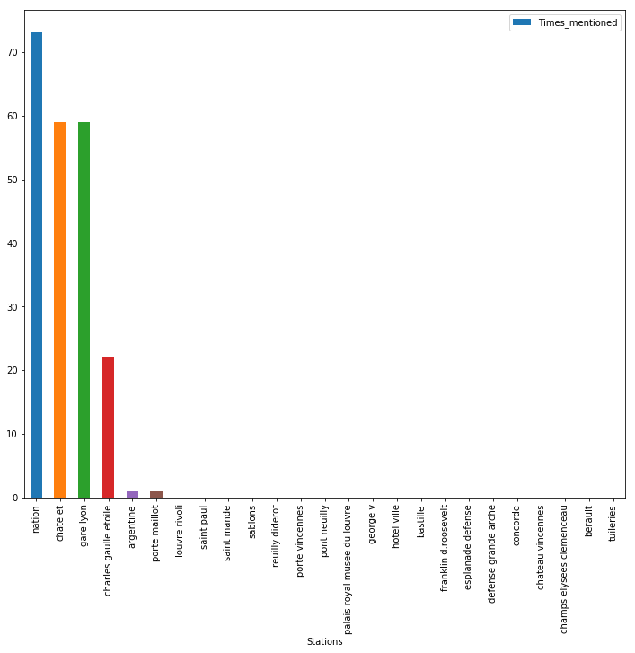

```python
import json
import re
import pandas as pd
import numpy as np
import matplotlib.pyplot as plt
import datetime
import subprocess
import os
import urllib.request
import unidecode
#%matplotlib inline

def read_metro_name():
    metroline_names = []
    filenames = []
    with open('Twitter_accounts.txt', 'r') as f:
        files = f.readlines()
        for fi in files:
                onefile = fi.rstrip('\n')
                metroline_names.append(onefile)
                filenames.append('user_timeline_'+onefile+'.jsonl')
    return metroline_names, filenames

def clean_text(text):
    text = text.lower()
    text = re.sub(r"-", " ", text)
    text = re.sub(r"\sd\'", "de ", text)
    text = re.sub(r"\sl\'", "le ", text)
    text = re.sub(r"\bl\'", "le ", text)

    text = re.sub(r"\sle\s", " ", text)
    text = re.sub(r"\sla\s", " ", text)
    text = re.sub(r"\sles\s", " ", text)
    text = re.sub(r"\ble\s", " ", text)
    text = re.sub(r"\bla\s", " ", text)
    text = re.sub(r"\bles\s", " ", text)
    text = re.sub(r"\sde\s", " ", text)
    text = re.sub(r"\sen\s", " ", text)
    text = re.sub(r"\sdes\s", " ", text)
    text = re.sub(r"\sà\s", " ", text)
    text = re.sub(r"\sau\s", " ", text)
    text = re.sub(r"\saux\s", " ", text)
    text = re.sub(r"\ssur\s", " ", text)
    text = re.sub(r"\\'", " ", text)
    text = unidecode.unidecode(text)
    text = re.sub('\s+', ' ', text)
    text = text.strip(' ')
    return text

def detect_problem_finished(x):
    for i in list_traffic_signe_problem_finished:
        if bool(re.search(i,x, re.IGNORECASE)):
            value = True
            break
        else:
            value = False
    return value

def Calculate_incidents(filename):
    list_line_dict = []
    with open(filename, 'r') as f:
        for line  in f.readlines():
            line_dict = json.loads(line)
            list_line_dict.append(line_dict)

    df = pd.DataFrame(list_line_dict)
    df['text'] = df['text'].apply(clean_text)
    dict_month = {'Jan': '01', 'Feb': '02', 'Mar': '03','Apr': '04','May': '05','Jun': '06','Jul': '07','Aug': '08','Sep': '09','Oct': '10','Nov': '11','Dec': '12'}
    def func(x):
        x_new = [0,0,0,0,0,0]
        for i in range(len(x.split())):
            if i ==1:
                x_new[i] = dict_month[x.split()[i]]
            else:
                x_new[i] = x.split()[i]
        return ' '.join(x_new)
    df['created_at'] = df['created_at'].apply(func)
    first_date_split = df['created_at'].iloc[-1].split()
    last_date_split = df['created_at'].iloc[0].split()
    d0 = date(int(first_date_split[5]), int(first_date_split[1]), int(first_date_split[2]))
    d0_str = first_date_split[5]+'-'+first_date_split[1]+'-'+first_date_split[2]
    d1 = date(int(last_date_split[5]), int(last_date_split[1]), int(last_date_split[2]))
    d1_str = last_date_split[5]+'-'+last_date_split[1]+'-'+last_date_split[2]    
    Num_days = (d1-d0).days
    list_traffic_signe_problem_finished = ['fin', 'terminé', 'rétabli',]
    list_days = [d0_str, d1_str, Num_days]

    df['traffic_problem'] = df['text'].apply(detect_problem_finished)
    count_traffic_problem = df[df['traffic_problem'] == True].shape[0]
    return df, list_traffic_signe_problem_finished, list_days, count_traffic_problem
    
def plot_incidents(mode):
    metroline_names = read_metro_name()[0]
    filenames = read_metro_name()[1]
     
    fig, axes = plt.subplots(nrows=34, ncols=1, figsize=(10,150))
    fig.subplots_adjust(hspace=1.2)
    
    for filename in filenames:
        df = Calculate_incidents(filename)[0]
        list_traffic_signe_problem_finished = Calculate_incidents(filename)[1]
        list_days = Calculate_incidents(filename)[2]
        count_traffic_problem = Calculate_incidents(filename)[3]
        
        d0_str = list_days[0]
        d1_str = list_days[1]
        Num_days = list_days[2]
        
        m = filenames.index(filename)
        
        if mode == 'by_hour':
            df['Heure_Incident_Terminé'] = df['created_at'].apply(lambda x: x.split()[3].split(':')[0])
            result = df[df['traffic_problem'] == True].groupby(df['Heure_Incident_Terminé']).size().divide(Num_days)
        elif mode == 'by_year_month':
            df['Mois_Incident_Terminé'] = df['created_at'].apply(lambda x: x.split()[5]+'-'+x.split()[1])
            result = df[df['traffic_problem'] == True].groupby(df['Mois_Incident_Terminé']).size()
            
        
        titlename = 'Données Twitter du '+metroline_names[m]+'\n de '+d0_str+' à '+d1_str+'  pour ('+str(Num_days)+') jours'
        result.plot(kind='bar',title=titlename, ax=axes[m])
        
def load_sncf_data(url, file_sncf):
    path = os.getcwd()

    urllib.request.urlretrieve(url, path+'/'+file_sncf)    
    
def plot_sncf_twitter_comparison():
    
    fig, axes = plt.subplots(nrows=2, ncols=1, figsize=(6,10))   
    
    
    url = 'https://ressources.data.sncf.com/explore/dataset/ponctualite-mensuelle-transilien/download/?format=csv&timezone=Europe/Berlin&use_labels_for_header=true'
    file_sncf = 'ponctualite-mensuelle-transilien.csv'
    load_sncf_data(url, file_sncf)
    
    df_sncf = pd.read_csv(file_sncf, sep=';')
    df_sncf['Taux_retard'] = df_sncf['Taux de ponctualité'].apply(lambda x: float("{0:.1f}".format(100-x)))
    df_sncf_stats = df_sncf[['Ligne','Taux_retard']]
    df_sncf_stats = df_sncf_stats.groupby(df_sncf_stats['Ligne']).sum().divide(df_sncf.shape[0]/13).reset_index()
    df_sncf_stats = df_sncf_stats[df_sncf_stats['Ligne']!='K']
    dict_NetU = {'Ligne': 'N/U', 'Taux_retard': (df_sncf_stats[df_sncf_stats['Ligne']=='N'].iloc[:,1].item() + df_sncf_stats[df_sncf_stats['Ligne']=='U'].iloc[:,1].item())/2
    }
    df_sncf_stats = df_sncf_stats.append(dict_NetU, ignore_index=True)
    df_sncf_stats = df_sncf_stats[df_sncf_stats['Ligne']!='N']
    df_sncf_stats = df_sncf_stats[df_sncf_stats['Ligne']!='U']
    df_sncf_stats = df_sncf_stats.sort_values('Taux_retard', ascending=False)
    df_sncf_stats.plot.bar(x='Ligne', y='Taux_retard', ax=axes[0], \
                          color=['red', 'green', 'blue', 'lime', 'orange','cyan','black','olive','yellow','darksalmon','purple'])


    List_compare_sncf = ['RER_A', 'RERB', 'RERC_SNCF', 'RERD_SNCF','RERE_SNCF', 'LIGNEH_SNCF' \
                         , 'LIGNEJ_SNCF', 'LIGNEL_SNCF', 'LIGNESNETU_SNCF', 'LIGNEP_SNCF', 'LIGNER_SNCF']
    List_new_name = ['A','B','C','D','E','H','J','L','N/U', 'P', 'R']

    counts = []
    for fi in List_compare_sncf:
        filename = 'user_timeline_'+fi+'.jsonl' 
        Days_twitter = Calculate_incidents(filename)[2][2]
        Rate_traffic_problem = Calculate_incidents(filename)[3]
        Rate_per_days = Rate_traffic_problem/Days_twitter
        counts.append((fi, Rate_per_days))
    df_stats = pd.DataFrame(counts, columns=['line', 'Ratio_Traffic_Problem_per_day'])


    df_stats['Line_new_name'] = pd.Series(List_new_name)
    df_stats = df_stats[['Line_new_name', 'Ratio_Traffic_Problem_per_day']]
    df_stats = df_stats.sort_values('Ratio_Traffic_Problem_per_day', ascending=False)

    df_stats.plot.bar(x='Line_new_name', y='Ratio_Traffic_Problem_per_day', ax=axes[1], \
                      color=['red', 'green', 'blue', 'black', 'cyan','yellow','olive','orange','darksalmon','lime','purple'])
    
def Get_traffic_problem_stations(filenames, metroline_names):
    # load sncf station name data
    url = 'https://opendata.stif.info/explore/dataset/emplacement-des-gares-idf/download/?format=csv&timezone=Europe/Berlin&use_labels_for_header=true'
    file_name = 'List_stations.csv'
    load_sncf_data(url, file_name)
    df_stations = pd.read_csv(file_name, ';')
    # clean data
    df_stations['nom_iv_new'] = df_stations['nom_iv'].apply(clean_text)
    # Get a dict for twitter-line: sncf-line 
    df_stations[df_stations['res_com'] == 'M3bis']['res_com'].apply(lambda x: 'M3')
    df_stations[df_stations['res_com'] == 'M7bis']['res_com'].apply(lambda x: 'M7')
    df_stations[df_stations['res_com'] == 'LIGNE N']['res_com'].apply(lambda x: 'LIGNE NetU')
    df_stations[df_stations['res_com'] == 'LIGNE U']['res_com'].apply(lambda x: 'LIGNE NetU')
    dict_station_to_station = {}
    list_sncf = ['M1',  'M2', 'M3', 'M4', 'M5', 'M6', 'M7',
            'M8', 'M9','M10',
           'M11', 'M12', 'M13', 'M14', 'RER A', 'RER B', 'RER C', 'RER D',
           'RER E', 'LIGNE H', 'LIGNE J', 
           'LIGNE L',  'LIGNE NetU', 'LIGNE P', 'LIGNE R', 'T1', 'T2', 'T3A', 'T3B', 'T5', 'T6', 'T7', 'T8', 'T11']

    with open('Twitter_accounts.txt', 'r') as f:
        list_twitter = []
        for line in f.readlines():
            list_twitter.append(line.rstrip('\n'))
    # Create a list of dicts for station:mentioned_times for every line
    for i in range(34):
        dict_station_to_station[list_twitter[i]] = list_sncf[i]
        List_dict_count_stations = []
        
    for filename in filenames:
        df = Calculate_incidents(filename)[0]
        List_stations = df_stations[ df_stations['res_com'] == dict_station_to_station[metroline_names[filenames.index(filename)]]]['nom_iv'].apply(clean_text)
        List_stations = List_stations.tolist()
        print(dict_station_to_station[metroline_names[filenames.index(filename)]])

        # Decide to match station name from the last word since it may give more accuracy.
        List_stations_last_word = []
        for i in List_stations:
            List_stations_last_word.append(i.split()[-1])
        dict_count_stations = {}
        for i in List_stations:
            dict_count_stations[i] = 0

        def find_station(text):
            stations = []  
            for i in range(len(text.split())):
                for j in range(len(List_stations_last_word)): 
                    if List_stations_last_word[j] == text.split()[i]: # match last word of station
                        if ' '.join(text.split()[i+1-len(List_stations[j].split()):i+1]) ==  List_stations[j] : # match full name
                            # If station followwing words like: a destination de/ en direction de..
                            
                            stations.append(List_stations[j])
                            dict_count_stations[List_stations[j]] +=1
            return stations               
        # also return a dataframe with mentioned stations for each twitter in order to check result
        df['incident_station'+metroline_names[filenames.index(filename)]] = df['text'].apply(find_station)
        List_dict_count_stations.append(dict_count_stations)
    return df, List_dict_count_stations

def plot_traffic_problem_stations():
    metroline_names = read_metro_name()[0]
    filenames = read_metro_name()[1]
    df = read_metro_name()[1]

    List_dict_count_stations = Get_traffic_problem_stations(filenames, metroline_names)[1]
    List_df = []
    for dicts in List_dict_count_stations:
        counts = [(v,k) for k, v in dicts.items()]
        tmp = pd.DataFrame(counts, columns=['Times_mentioned','Stations'])
        List_df.append(tmp)
    df_all_stations_mentioned_stats = pd.concat(List_df, ignore_index=True)
    df_all_stations_mentioned_stats.groupby(['Stations']).sum().reset_index().sort_values(['Times_mentioned'], ascending = False).iloc[:50,:].plot(kind='bar', x = 'Stations', y='Times_mentioned', figsize=(12,10))
```


```python
plot_traffic_problem_stations()
```

    M1





```python
text = 'porte de l\'italie'
if 1 == 1:
    text = text.lower()
    text = re.sub(r"-", " ", text)
    text = re.sub(r"\sd\'", "de ", text)
    text = re.sub(r"\sl\'", "le ", text)
    text = re.sub(r"\sle\s", " ", text)
    text = re.sub(r"\sla\s", " ", text)
    text = re.sub(r"\sles\s", " ", text)
    text = re.sub(r"le\s", " ", text)
    text = re.sub(r"la\s", " ", text)
    text = re.sub(r"les\s", " ", text)

    text = re.sub(r"\sde\s", " ", text)
    text = re.sub(r"\sdes\s", " ", text)
    text = re.sub(r"\sà\s", " ", text)
    text = re.sub(r"\sau\s", " ", text)
    text = re.sub(r"\saux\s", " ", text)
    text = re.sub(r"\ssur\s", " ", text)
    text = re.sub(r"\\'", " ", text)
    text = re.sub('\s+', ' ', text)
    text = text.strip(' ')
text
```


    'portede italie'


```python
plot_sncf_twitter_comparison()
```


```python
plot_incidents('by_hour')
```


```python
plot_incidents('by_year_month')
```


```python
df_stations.columns
```


    Index(['Geo Point', 'Geo Shape', 'id_ref_zdl', 'gares_id', 'nom_gare',
           'nomlong', 'nom_iv', 'num_mod', 'mode_', 'fer', 'train', 'rer', 'metro',
           'tramway', 'navette', 'val', 'terfer', 'tertrain', 'terrer', 'termetro',
           'tertram', 'ternavette', 'terval', 'idrefliga', 'idrefligc', 'ligne',
           'cod_ligf', 'ligne_code', 'indice_lig', 'reseau', 'res_com', 'cod_resf',
           'res_stif', 'exploitant', 'num_psr', 'idf', 'principal', 'x', 'y'],
          dtype='object')


```python
df_stations[df_stations['res_com'] == 'M1'][['nom_gare', 'nom_iv']]
```


<div>
<style scoped>
    .dataframe tbody tr th:only-of-type {
        vertical-align: middle;
    }

    .dataframe tbody tr th {
        vertical-align: top;
    }

    .dataframe thead th {
        text-align: right;
    }
</style>
<table border="1" class="dataframe">
  <thead>
    <tr style="text-align: right;">
      <th></th>
      <th>nom_gare</th>
      <th>nom_iv</th>
    </tr>
  </thead>
  <tbody>
    <tr>
      <th>108</th>
      <td>Bérault</td>
      <td>Bérault</td>
    </tr>
    <tr>
      <th>117</th>
      <td>Château de Vincennes</td>
      <td>Château de Vincennes</td>
    </tr>
    <tr>
      <th>122</th>
      <td>Esplanade de la Défense</td>
      <td>Esplanade de la Défense</td>
    </tr>
    <tr>
      <th>138</th>
      <td>Nation</td>
      <td>Nation</td>
    </tr>
    <tr>
      <th>144</th>
      <td>Pont de Neuilly (Avenue de Madrid)</td>
      <td>Pont de Neuilly</td>
    </tr>
    <tr>
      <th>158</th>
      <td>Reuilly-Diderot</td>
      <td>Reuilly-Diderot</td>
    </tr>
    <tr>
      <th>230</th>
      <td>Bastille</td>
      <td>Bastille</td>
    </tr>
    <tr>
      <th>240</th>
      <td>Champs-Élysées-Clémenceau</td>
      <td>Champs-Elysées-Clémenceau</td>
    </tr>
    <tr>
      <th>248</th>
      <td>George-V</td>
      <td>George V</td>
    </tr>
    <tr>
      <th>254</th>
      <td>Gare de Lyon</td>
      <td>Gare de Lyon</td>
    </tr>
    <tr>
      <th>266</th>
      <td>La Défense - Grande Arche</td>
      <td>La Défense - Grande Arche</td>
    </tr>
    <tr>
      <th>288</th>
      <td>Saint-Paul (le Marais)</td>
      <td>Saint-Paul</td>
    </tr>
    <tr>
      <th>539</th>
      <td>Argentine</td>
      <td>Argentine</td>
    </tr>
    <tr>
      <th>559</th>
      <td>Concorde</td>
      <td>Concorde</td>
    </tr>
    <tr>
      <th>562</th>
      <td>Franklin D.Roosevelt</td>
      <td>Franklin-D.Roosevelt</td>
    </tr>
    <tr>
      <th>583</th>
      <td>Louvre-Rivoli</td>
      <td>Louvre-Rivoli</td>
    </tr>
    <tr>
      <th>592</th>
      <td>Porte Maillot</td>
      <td>Porte Maillot</td>
    </tr>
    <tr>
      <th>715</th>
      <td>Tuileries</td>
      <td>Tuileries</td>
    </tr>
    <tr>
      <th>854</th>
      <td>Châtelet</td>
      <td>Châtelet</td>
    </tr>
    <tr>
      <th>860</th>
      <td>Hôtel de Ville</td>
      <td>Hôtel de Ville</td>
    </tr>
    <tr>
      <th>873</th>
      <td>Les Sablons (Jardin d'acclimatation)</td>
      <td>Les Sablons</td>
    </tr>
    <tr>
      <th>939</th>
      <td>Charles De Gaulle-Étoile</td>
      <td>Charles de Gaulle Etoile</td>
    </tr>
    <tr>
      <th>963</th>
      <td>Palais Royal-Musée du Louvre</td>
      <td>Palais Royal-Musée du Louvre</td>
    </tr>
    <tr>
      <th>1008</th>
      <td>Porte de Vincennes</td>
      <td>Porte de Vincennes</td>
    </tr>
    <tr>
      <th>1014</th>
      <td>Saint-Mandé</td>
      <td>Saint-Mandé</td>
    </tr>
  </tbody>
</table>
</div>


```python
df_stations['nom_gare']
```


    0                    Ella Fitzgerald
    1               Porte de la Villette
    2                         Rosa Parks
    3                       Butte Pinson
    4                  Petit Pierrefitte
    5                        Roger Sémat
    6              Marché de Saint-Denis
    7             Villejuif-Louis Aragon
    8                          Lamartine
    9                   Domaine Chérioux
    10                    Auguste Perret
    11                    La Belle Epine
    12                Parc André Malraux
    13                   Hôpital Béclère
    14                           Louvois
    15                      Pablo Néruda
    16                     VIROFLAY R.D.
    17                   BOULAINVILLIERS
    18                            BOURAY
    19                    BOURG-LA-REINE
    20              BOUSSY-SAINT-ANTOINE
    21                           BIÈVRES
    22                   CROUY-SUR-OURCQ
    23                             ABLON
    24                           ANDRÉSY
    25                            ANTONY
    26                    ARCUEIL-CACHAN
    27                           ARPAJON
    28                          ASNIÈRES
    29      AUBERGENVILLE-ÉLISABETHVILLE
                        ...             
    1110                         La Noue
    1111              Chemin des Reniers
    1112                    Montempoivre
    1113              Porte de Charenton
    1114                Aulnay-sous-Bois
    1115                Georges Brassens
    1116                     Desnouettes
    1117                          Gargan
    1118                  Gaston Roulaud
    1119                Hôpital Avicenne
    1120         Issy-Val-de-Seine - RER
    1121       La Défense - Grande Arche
    1122                        La Ferme
    1123                     Les Coteaux
    1124                 Stade Géo André
    1125                  Porte d'Italie
    1126           Poterne des Peupliers
    1127                 Suzanne Lenglen
    1128                   Henri Farmann
    1129                 Epinay-Orgemont
    1130               L'Ile-Saint-Denis
    1131           Gare de Gennevilliers
    1132                      Le Village
    1133               Jacqueline Auriol
    1134                    Victor Basch
    1135                 Porte des Lilas
    1136                Adrienne Bolland
    1137               Porte de Bagnolet
    1138            Alexandra David-Néel
    1139                     Porte Dorée
    Name: nom_gare, Length: 1140, dtype: object


```python

fi = open('Usager_RERB_hashtaged.jsonl', 'w')
with open('user_timeline_Usager_RERB.jsonl', 'r') as f:
    for line  in f.readlines():
        s = json.loads(line)
        condition_1 = ( ''.join(s['text'].split()[:2]) == 'RT@RERB:')
        condition_2 = (bool(re.search("#RERB", s['text'],re.IGNORECASE)))                         
        condition_3 = (bool(re.search("@RERB", s['text'],re.IGNORECASE))) 
        condition_4 = (bool(re.search("\sRERB\s", s['text'],re.IGNORECASE)))  
        condition_5 = (bool(re.search("\sRER\sB\s", s['text'],re.IGNORECASE)))  

        if (condition_1 or condition_2 or condition_3 or condition_4 or condition_5):
            fi.write(line)
fi.close()


```


```python
fi = open('RERBnator_hashtaged.jsonl', 'w')
with open('user_timeline_RERBnator.jsonl', 'r') as f:
    for line  in f.readlines():
        s = json.loads(line)
        condition_1 = ( ''.join(s['text'].split()[:2]) == 'RT@RERB:')
        condition_2 = (bool(re.search("#RERB", s['text'],re.IGNORECASE)))                         
        condition_3 = (bool(re.search("@RERB", s['text'],re.IGNORECASE))) 
        condition_4 = (bool(re.search("\sRERB\s", s['text'],re.IGNORECASE)))  
        condition_5 = (bool(re.search("\sRER\sB\s", s['text'],re.IGNORECASE)))  

        if (condition_1 or condition_2 or condition_3 or condition_4 or condition_5):
            fi.write(line)
fi.close()
```


```python
list_traffic_signe_problem = ['perturbation', 'retard', 'incident', 'panne', 'alarme', 'avarie' \
                              'anormalie', 'signalisation', 'signal', 'acte de malveillance' \
                              'Bagage oublié', 'Interruption', 'perturbé', 'obstacle' \
                             'interrompu', 'Reprise', 'ralentissement', 'Accident', 'victime' \
                              'défaut', 'malaise', 'retardé', 'stationne']

def detect_problem(x):
    for i in list_traffic_signe_problem:
        if bool(re.search(i,x, re.IGNORECASE)):
            value = True
            break
        else:
            value = False
    return value
df['traffic_problem'] = df['text'].apply(detect_problem)
df[df['traffic_problem'] == True].groupby(df['created_hour']).size().plot(kind='bar',  figsize=(8,6))
 
```


    <matplotlib.axes._subplots.AxesSubplot at 0x7f7983f9dac8>


